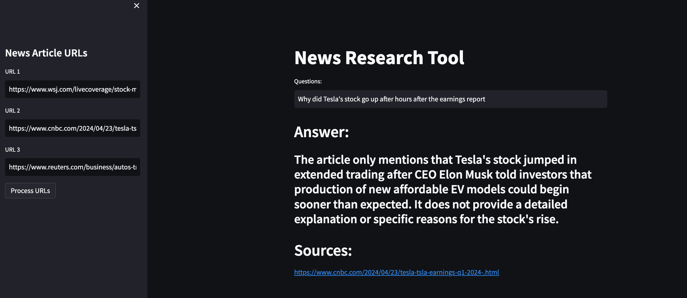

# Research Tool LLM: 
https://github.com/codebasics/langchain/tree/main/2_news_research_tool_project

Based on: https://github.com/codebasics/langchain/tree/main/2_news_research_tool_project

Uses textembedding-gecko@001 for embedding and local FAISS for the vector database.

Using UnstructuredURLLoader, I found that some blogs and documents would not load and there would be no data. After using SeleniumURLLoader instead, it would load a random selection of documentation with no issues.

